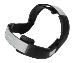

# platowork 

[](https://api.travis-ci.com/lassehjorthmadsen/platowork)

## An R Package with data from a test of the PlatoWork tDCS headset

## Background

Transcranial Direct Current Stimulation, tDCS, is a technique for cognitive enhancement. Many commercial devices are available. We tested one of those, the PlatoWork headset from [PlatoScience](https://www.platoscience.com/).

We (my son and I) used the speed typing test at [10fastfingers.com](https://10fastfingers.com/) to see if using the headset would enhance performance and/or learning rate. We did a number of test sessions each, usually one per day, with between 4 and 12 tests per session. Each session was performed with either:

  - No headset (for some initial benchmark test)
  - Headset with "stimulus A" 
  - Headset with "stimulus B"

Stimuli A and B referes to either a placebo or an actual direct current stimulation. Only after the test, we learned which was which. This functionality was available from a research version of the PlatoWork app.    

## Installation    

The R package `platowork` provides a small data set with the results of our experiment and a vignette with some analysis. 

To install the package from GitHub use:

```
devtools::install_github("https://github.com/lassehjorthmadsen/platowork")
library(platowork)
```
## Vignette

A vignette with a small analysis of the results can be read from R Studio using:

```
vignette("testing-platowork")
```

Or accessed directely at: [rpubs.com/lassehjorthmadsen/753220](https://rpubs.com/lassehjorthmadsen/753220)
